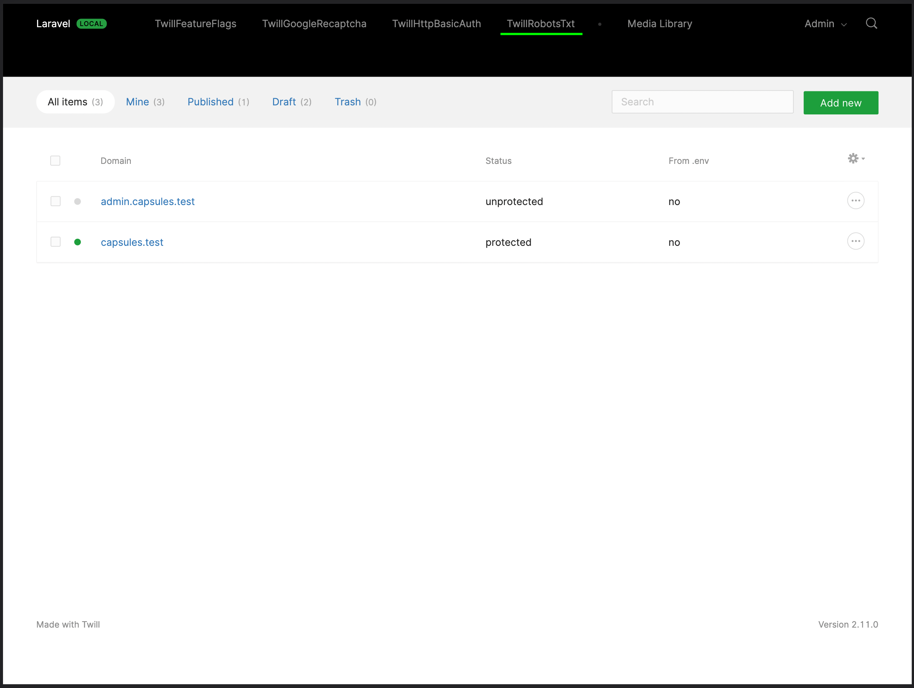
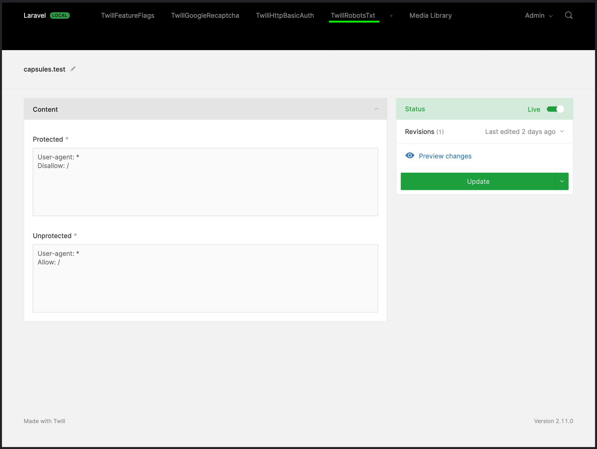

# Robots TXT Twill Capsule

This Twill Capsule is intended to enable developers to configure Robots TXT on their applications. 





## Domains

You add as many domains as you need and configure different passwords for each. Once you enable the `all domains (*)` entry, the same configuration will be used for all, and all other domains will be hidden.

## Middleware

A middleware is automatically added to all `web` routes, but you can configure this behaviour or even disable it to configure your middleware yourself:  

``` php
'middleware' => [
    'automatic' => true,

    'groups' => ['web'],

    'class' => \A17\TwillRobotsTxt\Http\Middleware::class,
],
```

## Using authentication

If you don't want to share a single username and password with everyone that will access your pages, you can configure the package to allow existing users, both on Twill (CMS) and/or Laravel (frontend), to use their own passwords to pass Robots TXT.

## Installing

### Require the Composer package:

``` bash
composer require area17/twill-robots-txt
```

### Publish the configuration

``` bash
php artisan vendor:publish --provider="A17\TwillRobotsTxt\ServiceProvider"
```

### Load Capsule helpers by adding calling the loader to your AppServiceProvider:

``` php
/**
 * Register any application services.
 *
 * @return void
 */
public function register()
{
    \A17\TwillRobotsTxt\Services\Helpers::load();
}
```

#### .env 

The configuration works both on `.env` or in the CMS settings. If you set them on `.env` the CMS settings will be disabled and overloded by `.env`. 

```dotenv
TWILL_ROBOTS_TXT_ENABLED=true
TWILL_ROBOTS_TXT_USERNAME=frontend
TWILL_ROBOTS_TXT_PASSWORD=secret
TWILL_ROBOTS_TXT_RATE_LIMITING_ATTEMPTS=5
TWILL_ROBOTS_TXT_TWILL_DATABASE_LOGIN_ENABLED=true
TWILL_ROBOTS_TXT_LARAVEL_DATABASE_LOGIN_ENABLED=true
```

## Contribute

Please contribute to this project by submitting pull requests.
